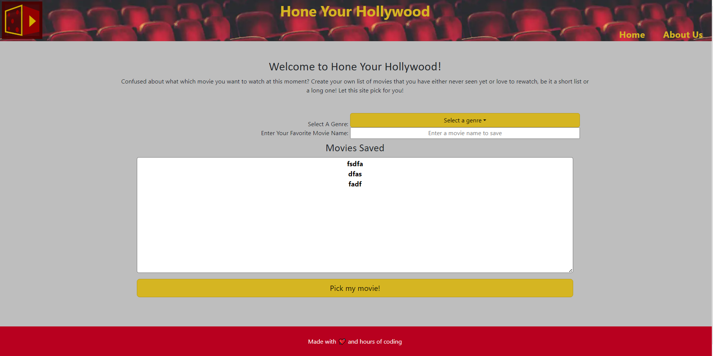
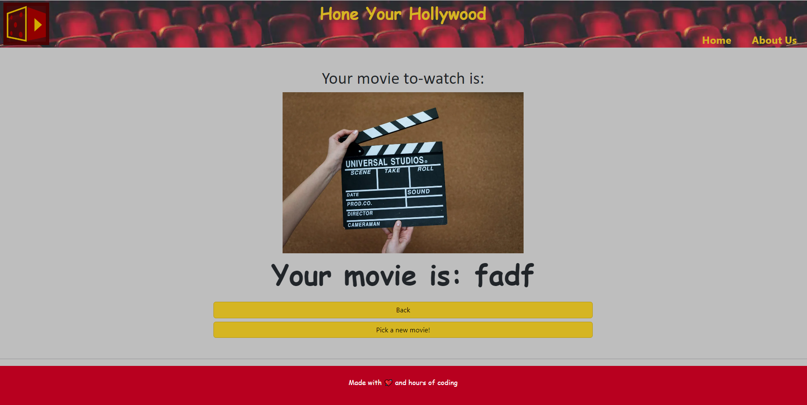
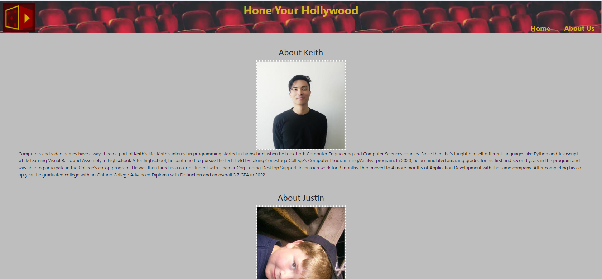

# Hone Your Hollywood Web Application

A small web application to let the user add their own list of movies that they would like to watch or re-watch, and have the app randomly pick between the movies in the list.

## Overall User Story #1:

AS A user
I WANT to input my favorite movies
SO THAT they can get saved into local storage

## User Story #2:

AS A user
I WANT to click on a button
SO THAT they application chooses a random movie from my list

## User Story #3:

AS A user
I WANT to click on a back button from the picked movie page
SO THAT the application would navigate back to the landing page

## User Story #4:

AS A user
I WANT to click on a button within the picked movie page
SO THAT the application would pick another movie without navigating to the landing page

## DESCRIPTION:

Initially, when you open Hone Your Hollywood, you are presented with our home page. Our home page includes a form where you will select the genre and title of your movie and enter the information to your saved list. Your saved movies will be displayed right beneath the form; and under that a button that will take you to a new page displaying your movie. On that page you can see your chosen movie, or you could generate a new movie. You may also choose go back to our home page using the back button or the Home button in the navigation bar. Next to that Home button is an About Us button that will direct you to a page that tells you a little bit about the developers bringing this creation to you today.

## SCREENSHOTS:

